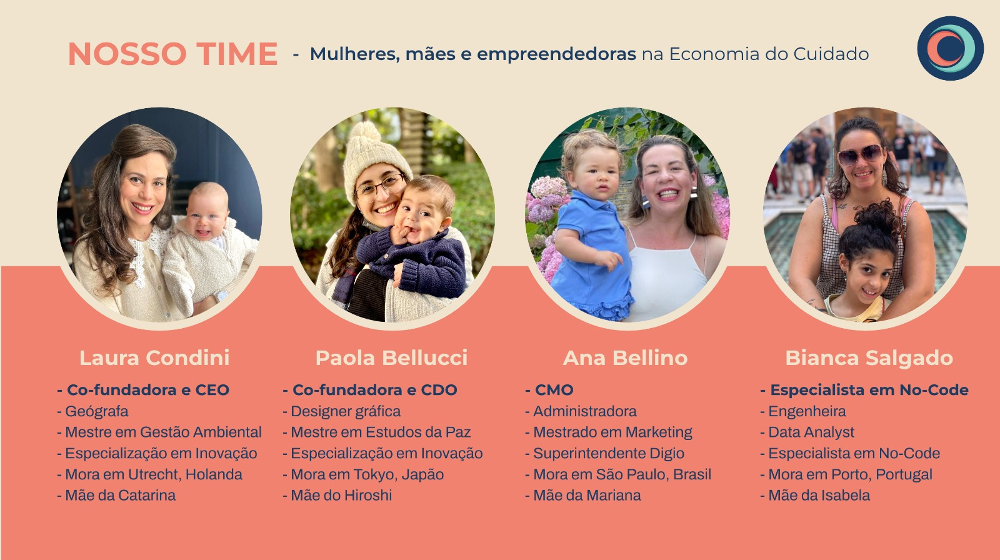

# Cocoon Family 🌍👨‍👩‍👧‍👦  
**Plataforma no-code para conectar famílias expatriadas no mundo, começando pela comunidade brasileira na Holanda.**

---
## 👫 Nosso Time
Somos mulheres, mães e empreendedoras na **Economia do Cuidado**, unidas para criar soluções que impactam a vida de muitas famílias.

---

## 🌟 Sobre o Projeto
**Cocoon Family** é um projeto inovador que utiliza ferramentas no-code para facilitar a conexão e suporte entre famílias expatriadas, abordando desafios como isolamento social e adaptação em um novo país.

Este repositório contém:
- Informações iniciais do projeto e MVP.
- Documentos de planejamento e links úteis.
- **Nota:** Por motivos de confidencialidade, os dados finais e completos não estão incluídos. Os arquivos de **Airtable** e **Softr** são apenas exemplos representativos do início do projeto.

---

## 📌 Links Importantes
- 🌐 **Site oficial:** [https://www.cocoonfamily.app](https://www.cocoonfamily.app)
- 📊 **Base Airtable (inicial):** [https://airtable.com/app2liKDgYs0HgFD0/shrqme2Tlroi1lsnm](https://airtable.com/app2liKDgYs0HgFD0/shrqme2Tlroi1lsnm)
- 🛠️ **Protótipo no Softr (inicial):** [https://sheridan2239.softr.app/](https://sheridan2239.softr.app/)

---

## 📂 Arquivos no Repositório
- 📄 **Pitch do MVP**: Apresentação inicial do projeto.
- 📜 **Documentação do lançamento**: Planejamento estratégico do MVP.
- 🔗 **Links importantes:** Documento com os principais links relacionados ao projeto.

---

## 🛠️ Tecnologias Utilizadas
- **Softr**: Para criação da interface no-code.
- **Airtable**: Para gestão de dados e organização.
- **API Google Maps**: Para funcionalidades de geolocalização e mapas interativos.

---

## 🎯 Missão
Criar um espaço virtual seguro e acolhedor para famílias expatriadas, proporcionando conexões reais e suporte para lidar com os desafios do dia a dia.

---

## 🚀 Como Rodar o Projeto
Este repositório é um espaço para **documentação** e **planejamento**. O projeto foi desenvolvido utilizando ferramentas no-code (Softr e Airtable).  
Siga os links acima para visualizar os protótipos iniciais.

---

## 📝 Licença
Este projeto é compartilhado com objetivos educacionais e informativos. Por favor, respeite os direitos autorais do time **Cocoon Family**.
